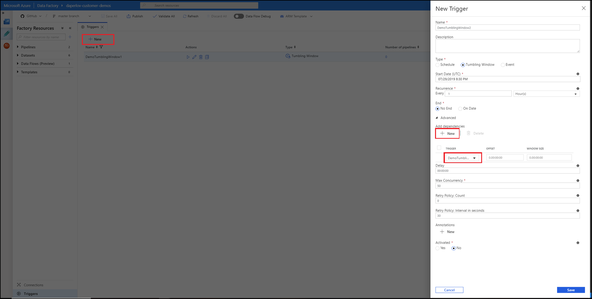
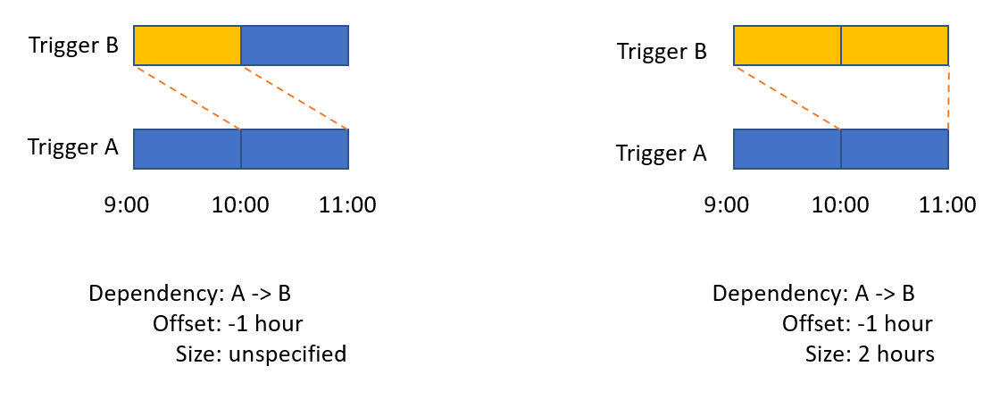

# Create a tumbling window trigger dependency

This article provides steps to create a dependency on a tumbling window trigger. For general information about Tumbling Window triggers, see [How to create tumbling window trigger](how-to-create-tumbling-window-trigger.md).

In order to build a dependency chain and make sure that a trigger is executed only after the successful execution of another trigger in the data factory, use this advanced feature to create a tumbling window dependency.

## Create a dependency in the Data Factory UI

To create dependency on a trigger, select **Trigger > Advanced > New**, and then choose the trigger to depend on with the appropriate offset and size. Select **Finish** and publish the data factory changes for the dependencies to take effect.



## Tumbling window dependency properties

A tumbling window trigger with a dependency has the following properties:

```json
{
    "name": "MyTriggerName",
    "properties": {
        "type": "TumblingWindowTrigger",
        "runtimeState": <<Started/Stopped/Disabled - readonly>>,
        "typeProperties": {
            "frequency": <<Minute/Hour>>,
            "interval": <<int>>,
            "startTime": <<datetime>>,
            "endTime": <<datetime – optional>>,
            "delay": <<timespan – optional>>,
            "maxConcurrency": <<int>> (required, max allowed: 50),
            "retryPolicy": {
                "count": <<int - optional, default: 0>>,
                "intervalInSeconds": <<int>>,
            },
			"dependsOn": [
				{
					"type": "TumblingWindowTriggerDependencyReference",
					"size": <<timespan – optional>>,
					"offset": <<timespan – optional>>,
					"referenceTrigger": {
						"referenceName": "MyTumblingWindowDependency1",
						"type": "TriggerReference"
					}
				},
				{
					"type": "SelfDependencyTumblingWindowTriggerReference",
					"size": <<timespan – optional>>,
					"offset": <<timespan>>
				}
			]
        }
    }
}
```

The following table provides the list of attributes needed to define a Tumbling Window dependency.

| **Property Name** | **Description**  | **Type** | **Required** |
|---|---|---|---|
| type  | All the existing tumbling window triggers are displayed in this drop down. Choose the trigger to take dependency on.  | TumblingWindowTriggerDependencyReference or SelfDependencyTumblingWindowTriggerReference | Yes |
| offset | Offset of the dependency trigger. Provide a value in time span format and both negative and positive offsets are allowed. This property is mandatory if the trigger is depending on itself and in all other cases it is optional. Self-dependency should always be a negative offset. If no value specified, the window is the same as the trigger itself. | Timespan<br/>(hh:mm:ss) | Self-Dependency: Yes<br/>Other: No |
| size | Size of the dependency tumbling window. Provide a positive timespan value. This property is optional. | Timespan<br/>(hh:mm:ss) | No  |

> [!NOTE]
> A tumbling window trigger can depend on a maximum of two other triggers.

## Tumbling window self-dependency properties

In scenarios where the trigger should not proceed to next window until the previous window is successfully completed, build a self-dependency. A self-dependency trigger that is dependent on the success of earlier runs of itself within the previous hr will have the below properties:

```json
{
	"name": "DemoSelfDependency",
	"properties": {
		"runtimeState": "Started",
		"pipeline": {
			"pipelineReference": {
				"referenceName": "Demo",
				"type": "PipelineReference"
			}
		},
		"type": "TumblingWindowTrigger",
		"typeProperties": {
			"frequency": "Hour",
			"interval": 1,
			"startTime": "2018-10-04T00:00:00Z",
			"delay": "00:01:00",
			"maxConcurrency": 50,
			"retryPolicy": {
				"intervalInSeconds": 30
			},
			"dependsOn": [
				{
					"type": "SelfDependencyTumblingWindowTriggerReference",
					"size": "01:00:00",
					"offset": "-01:00:00"
				}
			]
		}
	}
}
```
## Usage scenarios and examples

Below are illustrations of scenarios and usage of tumbling window dependency properties.

### Dependency offset


### Dependency size



### Self-dependency


### Dependency on another tumbling window trigger

A daily telemetry processing job depending on another daily job aggregating the last seven days output and generates seven day rolling window streams:


### Dependency on itself

A daily job with no gaps in the output streams of the job:


## Monitor dependencies

You can monitor the dependency chain and the corresponding windows from the trigger run monitoring page. Navigate to  **Monitoring > Trigger Runs**.


Click on the action icon to view all the dependent trigger runs of the selected window.


In the above example, a daily trigger is dependent on an hourly trigger with no window defined and an offset of 3 hrs. As a result, the trigger runs after 24 successful runs of the dependency.

## Next steps

Review [How to create a tumbling window trigger](how-to-create-tumbling-window-trigger.md).